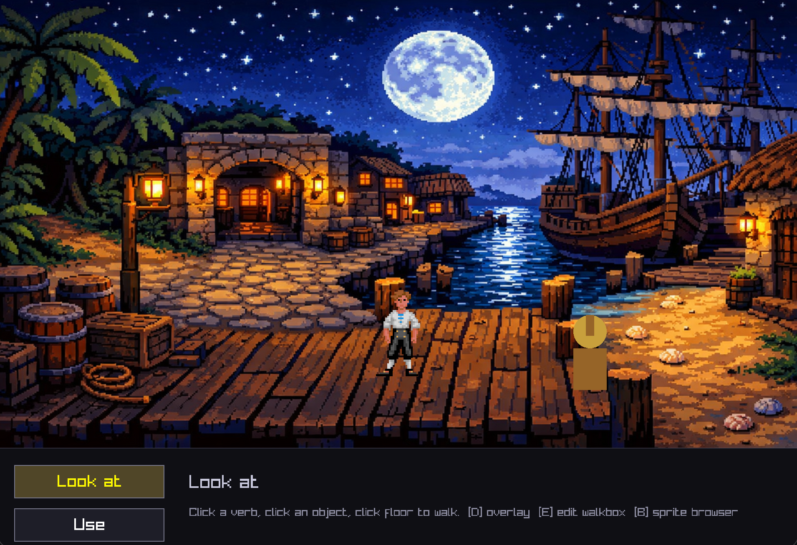

# scumm-game

A tiny SCUMM-style point-and-click adventure engine, written in C with [raylib](https://www.raylib.com/). One room, one dock, one rogueish protagonist walking around it.



## What it does

- **Click-to-walk actor.** Guybrush paths around the dock using Dijkstra over the walkbox visibility graph — so he routes around concave notches instead of shortcutting through them.
- **Animated sprites.** 8fps walk cycles in four directions, perspective-scaled with distance, rendered with nearest-neighbour filtering. Faces the direction of travel and idles on frame 0 when stopped.
- **Verb bar.** Classic *Look at / Use / Pick up* interaction model. Click a verb, click an object, actor walks over and speaks.
- **Walk-behind foregrounds.** Hand-authored polygons re-sample the background image and draw *over* the actor so he can pass behind things. Triangulated via ear-clipping, so any simple polygon works.
- **Live editors.** Walkboxes and foreground z-planes are drawn in-game with the mouse — no external tools.
- **Sprite browser.** Flip through raw sprite frames and tag them into named animations.

## Tools built into the binary

Press a key to switch into an editing mode. Everything saves to plain-text files alongside the executable.

| Key | Mode                     | What it does                                                                 |
|-----|--------------------------|------------------------------------------------------------------------------|
| `E` | Walkbox / foreground editor | Click to add verts, drag to move, click an edge to insert between neighbours |
| `W` | (in edit) walkbox           | Edit the blue walkable polygon                                               |
| `F` | (in edit) foreground        | Edit / cycle magenta walk-behind polygons                                    |
| `N` | (in edit) new foreground    | Add another foreground polygon                                               |
| `O` | (in edit) auto-order        | Sort verts by angle around centroid (unwraps self-intersections)             |
| `R` | (in edit) reset             | Clear active polygon                                                         |
| `S` | (in edit) save              | Save to `walkbox.txt` / `fg.txt`                                             |
| `D` | debug overlay               | Show walkbox + foreground outlines                                           |
| `B` | sprite browser              | Flip through frames, tag idle / walk_* / face_* for each direction, save to `sprites.txt` |

## File layout

```
main.c                     # single-file engine (~900 LOC)
Makefile                   # macOS / raylib 5.x via homebrew
run.sh                     # compile + run
assets/bg-dock.png         # backdrop
walkbox.txt                # authored walkable polygon
fg.txt                     # authored walk-behind polygons
sprites.txt                # raw-sheet → named-animation mapping
guybrush_sprites_v3/       # 250-frame raw sheet
sprites/guybrush/<anim>/   # exported, ready-to-render frames
export_sprites.sh          # bakes sprites.txt → sprites/guybrush/,
                           #   mirrors walk_right -> walk_left
player.txt                 # live actor position (runtime only)
```

## Build & run

```sh
brew install raylib   # one-time
./run.sh              # compile and launch
```

## Status

Minimal but it walks, talks, and draws. Intentionally **not** a reimplementation of the SCUMM bytecode VM — no .lfl / .he loading, no interpreter. Just the engine surface that makes a SCUMM-style game feel like a SCUMM game.
